# Honest Gap Assessment & Implementation Task Plan

> Sources: `auditupdate.md`, `audit1.md`, and spot-checks of `jdc-frontend` + `jira-platform` (May 2026).
> **Verdict:** Navigator is **usable for demos and single-team dev**, but **not** Jira Data Center–complete. No audit phase is 100% end-to-end enterprise-grade.

---

## Executive summary (honest)

| Dimension | Estimated parity | Honest label |
|-----------|------------------|--------------|
| Issue Navigator (split view, JQL, filters) | **~65–72%** | **Partial** — core path works |
| Workflow enforcement | **~85–90%** | **Strong** — bypass removed; admin WF 500s still seen in dev |
| Screen scheme / fields | **~55–65%** | **Partial** — project-level screens, not issue-type runtime |
| Bulk / audit / export | **~70–80%** | **Partial** — implemented in code; needs all services up + E2E proof |
| Permissions (RBAC) | **~70%** | **Partial** — UI gates exist; not every API fail-closed |
| Realtime / events | **~60%** | **Partial** — WS + local bus; no search/board/notification consumers |
| Plugins (Xray-style) | **~15%** | **Stub** — registry only |
| DC visual parity | **~40–45%** | **Weak** — shell OK, not pixel/behavior parity |

**Critical observation (unchanged from audits):** Many features are **initiated** (UI + API skeleton) but **not operationally enforceable** in every environment (comment-service down, audit DB missing, workflow admin 500, Flyway V7 history).

---

## What is FULLY implemented (evidence-backed)

These work when **gateway 8080**, **issue-service 8084**, **workflow 8085**, and **frontend 3000** are running, and DB migrations are applied.

| Capability | Evidence | E2E signal |
|------------|----------|------------|
| Global + project issue navigator (split view) | `GlobalIssueNavigatorPage`, `ProjectIssueNavigatorPage` | URL ` /issues/navigator/:key?filter=...&tab=...` |
| JQL search (no silent fallback) | `issueApi.jqlSearch`, `pin-jql-error` | Bad JQL shows error, not `getAll` |
| JQL `WAS` / `CHANGED` (basic) | `JqlExpressionParser`, `JqlChangeHistorySpecs` | `GET .../search?jql=status WAS "Done"` |
| URL: filter, sort, JQL, tab, issue **keys** | `useIssueViewContext` | Shareable project URLs |
| Saved filters (DB) + in-nav save | `SavedFilterService`, `SaveFilterModal` | `POST/GET /api/filters` |
| Workflow transitions (no PATCH bypass) | `IssueService.updateIssueStatus` | Fails if workflow-service down |
| Transition UI + `requiredPermission` badge | `TransitionScreenForm` | Detail header transitions |
| Issue CRUD + clone/watch/move/link | `IssueController`, `IssueMoreMenu` | REST + UI |
| Change history on edit | `ChangeHistoryService` in `updateIssue` | Activity tab |
| Bulk change (real backend) | `BulkIssueOperationService`, `BulkOperationsModal` | `POST /api/bulk-operations` |
| Central audit trail (when audit-service up) | `AuditIntegrationClient`, `IssueAuditTab` | `GET /api/audit/logs/ISSUE/{id}` |
| Export CSV + rank + share URL | `IssueExportService`, `NavigatorActionsMenu` | Export + `PATCH .../rank` |
| Comments (when gateway route fixed) | StripPrefix removed on comment route | `GET /api/comments/issue/{id}` |
| Issue outbox + WS broadcast | `IssueEventOutbox`, `IssueRealtimeBroadcaster` | `/ws/issues` + invalidation |
| Screen fields API | `GET /api/admin/issues/screens/{id}/fields` | Admin + `screenApi` |
| Edit modal: attachments tab, update fix | `EditIssueModal`, `IssueAttachmentUpload` | PUT without bad `priorityId` |
| Pagination (50/page) | Navigator list queries | Pager UI |
| Lightweight list virtualization | `VirtualizedIssueList` @ 30+ rows | Scroll perf (not `react-window`) |

---

## What is PARTIALLY implemented (honest caveats)

| Capability | What works | What is still missing |
|------------|------------|------------------------|
| **Screen scheme** | Project scheme → CREATE/EDIT/VIEW field lists; `ScreenDrivenEditFields` + builtins | **Issue-type-specific** screens; full `DynamicFieldRenderer` on **create**; view panel not renderer-driven |
| **Bulk operations** | Real issue-service impl (not sprint mock) | `MOVE_TO_SPRINT` not implemented; needs permission checks per op; E2E often not run in CI |
| **Audit** | Client + tab | **Best-effort** (async, swallows errors); Phase 13 table in audit still said "Deferred" — doc drift; needs audit-service + V1 schema |
| **Export/rank** | CSV export cap 10k; rank swap in project | Not true LexoRank; rank not in JQL sort; export not in issue navigator "Tools" DC menu |
| **Realtime** | WS + `issueEventBus` + banner | No guaranteed multi-user proof; outbox not consumed by search/board; workflow outbox separate |
| **Permissions** | `useProjectPermission`, some API checks | `hasPermission ?? true` patterns removed in places but **not all** actions; link API enforcement flagged in audit |
| **List panel** | Virtualized window, bulk checkboxes | Not `react-window`; infinite scroll deferred; avatars/assignee picker incomplete |
| **Create issue** | Screen visibility helpers | Attachments on create; full dynamic fields; transition screen on create |
| **Detail panel** | Tabs, inline description, worklog | Voters UI; attachment polish; autosave; optimistic rollback |
| **Phase 1 routing** | Redirect to navigator | `/issues/:issueId` still exists; scroll offset not in URL |
| **Project sidebar** | Structure + plugin hook | Reports/Releases/Components **stubs** |
| **Plugins** | `NavigatorPluginRegistry` skeleton | **Zero** production registrations (Xray, etc.) |
| **JQL** | Core WHERE/ORDER BY, WAS | `membersOf`, `DURING`, `POST /api/jql/search` unified endpoint |
| **Production** | Error boundaries, Flyway V11 | Duplicate V7 history risk; TS debt; all microservices not in one compose |

---

## What is NOT implemented (still real gaps)

| Gap | Phase | Severity |
|-----|-------|----------|
| Issue-type-specific screen resolution at runtime | 5, 11 | **Critical** |
| `DynamicFieldRenderer` on create + view (edit: partial only) | 5, 11 | **High** |
| Plugin module registrations (navigator panels) | 15, 9 | **High** |
| `react-window` / 100k issue scale | 2, 16 | **High** |
| Advanced JQL (`membersOf`, `DURING`, unified search API) | 14 | **Medium** |
| Outbox → search indexer / boards / notifications | 8, 13 | **Medium** |
| Project sidebar real modules (Reports, Releases, Components) | 9 | **Medium** |
| Attachments on create; voters/watchers polish | 3, 11 | **Medium** |
| Full DC visual chrome | 16 | **Medium** |
| URL scroll restoration | 1, 12 | **Low** |
| Deprecate legacy `/issues` table view | 1 | **Low** |
| Workflow **admin** designer 500s (publish/layout/draft) | 6, admin | **Ops** (blocks admin, not navigator runtime) |

---

## Doc inconsistencies to fix

`auditupdate.md` has conflicting lines:

- Phase 13 says "Central audit service — **Deferred**" but pass 2 marks audit **DONE**.
- Phase 2 lists virtualization both **Done** and **Deferred**.
- Remaining backlog still lists export/audit as open though pass 2–3 closed them.

**Recommendation:** Treat **code in repo** as source of truth; run E2E scripts before marking DONE.

---

# Implementation tasks (epics I will perform)

Below: **Task** = epic, **Subtask** = ordered work with acceptance criteria.

---

## EPIC-1: Runtime screen scheme (issue-type aware) — P0

**Audit refs:** audit1 Phase 5 (CRITICAL); auditupdate Phase 5 ~88% (overstated).

**Goal:** CREATE/EDIT/VIEW fields resolve by **project + issue type**, not one flat screen per operation.

| ID | Subtask | Implementation plan | Acceptance |
|----|---------|---------------------|------------|
| 1.1 | Backend: `GET /api/projects/{id}/scheme/screens?issueTypeId=` | Extend project scheme service to return screenId per operation for issue type | API returns create/edit/view screen IDs |
| 1.2 | Backend: wire issue-type → screen scheme mapping | Use admin scheme tables or workflow scheme linkage | Different types can map to different screens |
| 1.3 | Frontend: `useIssueScreenFields(projectId, operation, issueTypeId)` | Pass `issueTypeId` from create/edit context | Changing type reloads field set |
| 1.4 | Fail-closed UX | If mapped screen empty → blocking error, not silent defaults | No silent `fallbackFields` when scheme mapped |
| 1.5 | E2E | Script: create Bug vs Story, assert different field lists | Automated check |

**Estimate:** 3–5 days.

---

## EPIC-2: DynamicFieldRenderer end-to-end — P0

**Audit refs:** Phase 5, 11; component exists but not wired on create.

| ID | Subtask | Implementation plan | Acceptance |
|----|---------|---------------------|------------|
| 2.1 | `CreateIssueModal` → `ScreenDrivenCreateFields` | Mirror `ScreenDrivenEditFields`; map screen keys → renderer | Create uses definitions API + builtins |
| 2.2 | Issue detail **view** → dynamic sidebar/details | Replace static field grid where keys known | View matches screen scheme |
| 2.3 | `/api/fields/definitions` stability | Ensure gateway route + fallback builtins documented | Modal works offline from definitions failure |
| 2.4 | Validators from `validationRules` | Required fields block submit | Cannot create without summary |
| 2.5 | E2E | Create issue with only scheme-visible fields | Playwright or API+UI script |

**Estimate:** 3–4 days. **Depends on:** EPIC-1.1–1.3.

---

## EPIC-3: Permissions fail-closed (enterprise RBAC) — P1

**Audit refs:** audit1 Phase 7; auditupdate ~80%.

| ID | Subtask | Implementation plan | Acceptance |
|----|---------|---------------------|------------|
| 3.1 | Audit all issue/link/comment/attachment controllers | List endpoints without `X-User-Id` checks | Checklist doc |
| 3.2 | Backend: deny when permission service unavailable | Match `IssueController` fail-safe (deny), not allow | 503/403, not 200 |
| 3.3 | Frontend: remove implicit `true` when no userId | `useProjectPermission` returns false if no user | Buttons hidden without login |
| 3.4 | Bulk ops permission matrix | EDIT_ISSUES / DELETE_ISSUES / RESOLVE per op type | Unauthorized bulk returns 403 |
| 3.5 | E2E | User without EDIT cannot update via API | Integration test |

**Estimate:** 2–3 days.

---

## EPIC-4: Advanced JQL & search contract — P1

**Audit refs:** Phase 14; audit1 global JQL.

| ID | Subtask | Implementation plan | Acceptance |
|----|---------|---------------------|------------|
| 4.1 | `membersOf()` in parser | Resolve group → user ids via user/project service | JQL `assignee in membersOf("jira-dev")` works |
| 4.2 | `DURING()` / date predicates | Extend `JqlExpressionParser` + specs | Date range filters work |
| 4.3 | `POST /api/jql/search` | Thin wrapper over existing search; same response shape as GET | Single contract for tools |
| 4.4 | Navigator advanced search bar | Wire to POST when query > 2k chars | Large JQL supported |
| 4.5 | E2E | Extend `e2e-*.ps1` with membersOf/DURING samples | Scripts pass |

**Estimate:** 4–6 days.

---

## EPIC-5: Event consumers (outbox → search, boards, notifications) — P2

**Audit refs:** Phase 8 deferred items.

| ID | Subtask | Implementation plan | Acceptance |
|----|---------|---------------------|------------|
| 5.1 | Outbox poller in issue-service | Read `issue_event_outbox`, mark published | Rows processed |
| 5.2 | Publish to search-service (or index stub) | HTTP/event to search 8088 | Issue update appears in search within N sec |
| 5.3 | Kanban board invalidation contract | Document event payload; frontend board listens | Board column moves on external update |
| 5.4 | Notification on assign/transition | notification-service 8087 hook | In-app notification record created |
| 5.5 | E2E | Two-browser or API simulation | Second client sees update |

**Estimate:** 5–7 days.

---

## EPIC-6: Navigator scale & DC list UX — P2

**Audit refs:** Phase 2, 16.

| ID | Subtask | Implementation plan | Acceptance |
|----|---------|---------------------|------------|
| 6.1 | Add `react-window` to `jdc-frontend` | Replace custom virtual list | 1k rows scroll smooth |
| 6.2 | Cursor-based pagination / infinite scroll | Optional "load more" preserving selection | No scroll jump on append |
| 6.3 | Persist `listScrollOffset` in URL | `useIssueViewContext` param `scroll` | Refresh restores scroll |
| 6.4 | DC row chrome | Assignee avatar, status category colors | Visual audit checklist |
| 6.5 | E2E perf smoke | 500+ issues JQL, measure FPS | Document baseline |

**Estimate:** 3–4 days.

---

## EPIC-7: Plugin registrations (Xray-style extensibility) — P2

**Audit refs:** Phase 15 ~35%; audit1 plugin sections.

| ID | Subtask | Implementation plan | Acceptance |
|----|---------|---------------------|------------|
| 7.1 | Register "Tests" panel plugin | Frontend `navigatorPluginRegistry.register` + route | Panel shows in project nav |
| 7.2 | Backend workflow `NavigatorPluginRegistry` seed | One sample plugin metadata API | GET lists plugins |
| 7.3 | Issue detail plugin zone | Sidebar slot for plugin contributions | Plugin renders in split view |
| 7.4 | Docs for third-party registration | `.cursor/plugin-dev.md` | External team can add module |

**Estimate:** 4–5 days.

---

## EPIC-8: Project sidebar & create polish — P3

| ID | Subtask | Implementation plan | Acceptance |
|----|---------|---------------------|------------|
| 8.1 | Components page (real API) | `/api/components` project list | Not a stub link |
| 8.2 | Releases/versions page | version-service integration | Versions list loads |
| 8.3 | Attachments on create | Upload in `CreateIssueModal` after create | File attached to new issue |
| 8.4 | Voters/watchers UI on detail | Watch toggle state; voter count | Matches DC basics |

**Estimate:** 4–5 days.

---

## EPIC-9: Production hardening & honest doc sync — ongoing

| ID | Subtask | Implementation plan | Acceptance |
|----|---------|---------------------|------------|
| 9.1 | Single `docker-compose` or dev script | Start gateway + issue + workflow + audit + comment + attachment | One command dev stack |
| 9.2 | Consolidated E2E suite | `scripts/e2e-all.ps1` runs bulk, audit, export, JQL | All green locally |
| 9.3 | Sync `auditupdate.md` | Remove contradictions; per-phase % from checklist | One source of truth |
| 9.4 | Fix workflow admin 500s | Investigate publish/layout/draft on 8085 | Admin designer loads |

**Estimate:** 2–3 days.

---

## Recommended execution order (what I will perform next)

```mermaid
flowchart LR
  E1[EPIC-1 Screen by issue type]
  E2[EPIC-2 DynamicFieldRenderer]
  E3[EPIC-3 Permissions fail-closed]
  E4[EPIC-4 Advanced JQL]
  E5[EPIC-5 Event consumers]
  E6[EPIC-6 react-window scale]
  E7[EPIC-7 Plugins]
  E8[EPIC-8 Sidebar polish]
  E9[EPIC-9 Hardening]

  E1 --> E2
  E2 --> E3
  E3 --> E4
  E4 --> E5
  E5 --> E6
  E6 --> E7
  E7 --> E8
  E8 --> E9
```



| Priority | Epic | Why first |
|----------|------|-----------|
| **P0** | EPIC-1, EPIC-2 | audit1 **CRITICAL** — without these, screen scheme is cosmetic |
| **P1** | EPIC-3, EPIC-4 | Security + search parity |
| **P2** | EPIC-5, EPIC-6, EPIC-7 | Enterprise scale & extensibility |
| **P3** | EPIC-8, EPIC-9 | Polish & ops |

---

## Verification commands (current repo)

```powershell
# Bulk + audit
jira-platform/scripts/e2e-bulk-audit.ps1

# Export + rank
jira-platform/scripts/e2e-export-rank-realtime.ps1

# Manual navigator
# http://localhost:3000/issues/navigator/TPX-1?filter=allopenissues&tab=activity
```

**Services required:** 8080 gateway, 8084 issue, 8085 workflow, 8086 comment, 8089 audit, 8090 attachment (for full module E2E).

---

## Sign-off criteria for "Jira DC Navigator complete"

- [ ] All 17 audit phases ≥ **90%** with E2E proof, not self-reported %
- [ ] Issue-type screen resolution proven
- [ ] No workflow bypass paths
- [ ] Permissions fail-closed on all issue mutations
- [ ] Bulk, export, filter share, audit, comments work with gateway compose
- [ ] `react-window` or equivalent at 10k+ rows
- [ ] At least one registered navigator plugin
- [ ] Advanced JQL functions documented and tested
- [ ] `auditupdate.md` matches repo with no contradictions

**Current sign-off:** **Not ready** — estimated **~68%** navigator parity, **~55%** production readiness.
