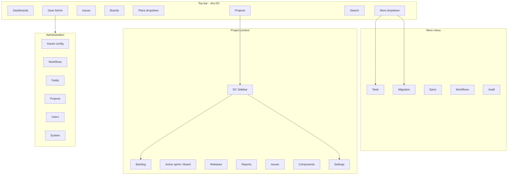

# Jira Data Center Information Architecture — Systems and Avionics

**Document ID:** `JIRA-DC-IA-001`  
**Date:** 2026-05-22  
**Scope:** Full-platform discoverability reorganization (UX = Jira DC, visual = Airbus)  
**Frame sources:** `new_video_frames` (111), `hq_frames` (reference), `DC - Systems ui gap analysys.md`  
**Code SSOT:** `jira-frontend/src/components/layout/jiraDcNavRegistry.ts`

---

## Design principle

| Layer | Rule |
|-------|------|
| **Structure** | Jira Data Center navigation, hierarchy, placement, progressive disclosure |
| **Surface** | Airbus branding, `airbus-theme.css`, `airbus-dc-bridge.css`, `--sa-*` tokens |
| **Engine** | Reuse existing pages/APIs — wire and expose, do not rebuild |

---

## 1. Complete feature visibility audit

### 1.1 Global (user) surface

| Feature domain | Primary entry (Jira DC) | Platform entry after IA pass | Status |
|----------------|-------------------------|------------------------------|--------|
| Dashboards | Top nav | `/dashboard` — top nav | Visible |
| Projects | Top nav | `/projects` — top nav | Visible |
| Issues (global) | Top nav | `/issues` — top nav | Visible |
| Boards | Top nav | `/boards` — top nav | Visible |
| Plans / AR | Top nav dropdown | Plans dropdown | Visible |
| Test management | Apps / admin | **More → Test management** | Visible |
| Migration / import | Admin / import | **More → Migration Center** | Visible |
| Epics | Project / issues | **More → Epics** | Visible |
| Workflows (app hub) | Admin Issues → Workflows | **More → Workflow hub** + admin | Visible |
| Search | Header | Header search → `/search` | Visible |
| Notifications | Header | Header bell | Visible |
| Administration | Gear | Gear + **More → Administration** | Visible |
| Create issue/project | Header Create | Global Create menu | Visible |

### 1.2 Project context (Jira Software sidebar)

Synced via `buildProjectNavItems()` in `jiraDcNavRegistry.ts` — used by **both** `ProjectDcSidebar` and workspace context rail.

| Item | Route | Visible |
|------|-------|---------|
| Overview | `/projects/:id` | Context rail + project index |
| Backlog | `.../backlog` | Sidebar + rail |
| Active sprints | `.../board/active` | Sidebar + rail |
| Board | `.../board/active` | Sidebar + rail |
| Releases | `.../releases` | Sidebar + rail (**added to context rail**) |
| Reports | `.../reports` | Sidebar + rail (**added to context rail**) |
| Issues | `.../issues` | Sidebar + rail |
| Components | `.../components` | Sidebar + rail (**added to context rail**) |
| Project settings | `.../settings/summary` | Sidebar footer + rail |

### 1.3 Project settings (14 sections)

All reachable from `/projects/:id/settings/:section` — sidebar in `ProjectSettingsDcLayout`.

Summary, Details, Issue types (admin deep links), Workflows, Screens, Fields, Priorities, Users and roles, Components, Versions, Permissions, Project links, Audit log, Re-index project.

### 1.4 Administration (global)

Reordered **Issues-first** per DC frames (`adminCategories.ts`):

Issues → Workflows → Fields → Projects → User management → System → Applications → Data Center → Audit & bulk → Test management.

**Newly linked in admin nav:** `directories`, `system/import`, individual DC ops (cache, indexing, jobs, services), workflow hub cross-link.

### 1.5 Workspace flyout (left rail categories)

| Category | Purpose |
|----------|---------|
| Planning | Dashboard, projects, programs, plans |
| Delivery | Issues, epics, boards, sprints |
| Workflows | Hub + **admin workflows** (deduplicated) |
| Test management | Full Xray-style suite (~20 links) |
| Tools | Search, GraphQL, notifications |
| Administration | Admin shortcuts (expanded DC ops) |
| Migration & audit | Migration Center views + audit |

### 1.6 Routes with contextual-only entry (by design)

Dynamic IDs (`/issues/:id`, `/tests/:testId`, `/workflows/:id/designer`) — entered from lists, boards, or search. Documented in flyout as “context” hints.

---

## 2. Pages / modules still hidden (orphan risk)

| Route / capability | Gap | Recommended fix |
|--------------------|-----|-----------------|
| `/epics/:epicId` | No list→detail breadcrumb in epic module | Add epic list header breadcrumb |
| `/workflows/:workflowId/designer` | Only via hub/open picker | Add “Recent workflows” in hub table |
| `/tests/:projectId` (param order) | Ambiguous with `tests/:testId` | Prefer query `?projectId=` (routing refactor P3) |
| `/admin/overview` | Alias only | Redirect documented |
| `/developer/graphql` | Flyout only | Listed under Tools + admin API |
| Portfolio `?tab=overview` vs `/portfolio` | Two URLs | Consolidate to one (P3) |
| Websudo banner | Not implemented | P2 cosmetic |
| Issue More menu (full DC 20+ items) | Partial | Map per API availability |

**Fixed in this pass:** `/tests/:testId/execute` route added; admin `directories` + `system/import` linked.

---

## 3. Incorrectly placed features (before → after)

| Feature | Before | After (IA) |
|---------|--------|------------|
| Tests, Migration | Top nav (non-DC) | **More** dropdown (still one click) |
| Workflows | 9 duplicate flyout links | 6 consolidated; admin path primary |
| Project Reports/Components | Sidebar only | Sidebar **+** context rail |
| Board + Active sprint | Duplicate context items | Scrum: both labeled; same path intentional |
| Audit | `/audit` vs `/admin/auditing` unclear | Both linked; labels distinguish scope |
| Custom fields | Duplicated in Data + Admin flyouts | Admin = CRUD; flyout = shortcut (acceptable) |

---

## 4. Missing Jira-style navigation (addressed)

| Pattern | Implementation |
|---------|----------------|
| DC primary top bar | `JIRA_DC_PRIMARY_TOP_NAV` + Plans + More |
| Project sidebar | `ProjectDcSidebar` + registry |
| Admin Issues-first | `JIRA_DC_ADMIN_CATEGORY_ORDER` |
| Breadcrumbs | `routeMeta.ts` + project segment enrichment |
| Back to app from admin | Admin header **Back to app** |
| Shared project nav SSOT | `jiraDcNavRegistry.ts` |

**Still missing (Jira DC optional):**

- Websudo elevation banner  
- Admin horizontal “Issues | Projects | System” tabs (using vertical flyout instead — acceptable)  
- “Manage apps” marketplace top link  

---

## 5. Broken user journeys

| Journey | Status | Notes |
|---------|--------|-------|
| Login → project → backlog → create issue | OK | |
| Login → project → board → drawer → issue | OK | |
| Login → project → issues navigator → detail | OK | |
| Login → project → settings → re-index | OK | |
| Login → gear → admin → workflows | OK | Issues-first nav |
| Login → More → migration → import wizard | OK | |
| Login → More → tests → test detail → execute | **Fixed** | Route `tests/:testId/execute` |
| Global issues vs project issues | OK | Two intentional entry points |
| Plans program portfolio | Partial | Dual URL pattern |

---

## 6. Admin hierarchy gaps

| Jira DC area | Platform coverage | Gap |
|------------|-------------------|-----|
| Issues (types, priorities, statuses) | Full admin routes | — |
| Workflows & schemes | Admin + `/workflows` hub | Switch scheme on project (P2) |
| Screens & screen schemes | Admin | — |
| Fields / custom fields | Admin | — |
| Projects (types, categories) | Admin | — |
| Users, groups, directories | Admin | Directories newly linked |
| Permissions & schemes | Admin | — |
| System import | `/admin/system/import` | Newly linked |
| Applications / links | Admin + project settings | — |
| DC cluster/cache/index/jobs | Admin | All linked in flyout |
| Audit | Admin + workspace `/audit` | — |
| Automation | Admin | — |
| Test management (plugin) | `/tests` + admin redirects | Extension, not core DC |

---

## 7. Project hierarchy gaps

| Jira DC | Status |
|---------|--------|
| Project sidebar vs portfolio overview | OK — sidebar hidden on index |
| Settings dual sidebar | OK — `ProjectSettingsDcLayout` |
| Scheme deep links from issue types | OK |
| Version/components in settings + nav | OK |
| Delete project section | Not in nav (destructive) — P3 |
| Switch workflow scheme | Read-only panel — P2 |

---

## 8. Remaining UX inconsistencies

- **Dual shells:** Workspace flyout vs project DC sidebar — intentional; both now aligned.  
- **Plans in top nav:** Advanced Roadmaps extension (not in DC video) — kept for product parity.  
- **Test management density:** 20+ test links — enterprise users expect under More + Quality flyout.  
- **Breadcrumb project name:** Shows “Project” until dynamic name hook added (P3).  
- **Airbus vs DC header:** Gradient DC header in workspace; flat white in admin — by design.

---

## 9. Remaining parity gaps with Jira DC (screenshots)

Reference: `docs/DC - Systems ui gap analysys.md` (~73% weighted).

| Area | Remaining |
|------|-----------|
| UI composition | Websudo, release-in-DONE column, full More menu |
| Functional | Dedicated project re-index job, scheme switch |
| Screenshot-specific | MK Kanban “older issues” hint |
| Advanced Roadmaps | Separate SSOT (`JIRA_DC_UI_COMPOSITION_GAP_ANALYSIS.md`) |

---

## 10. Screens / features still needing implementation

| ID | Feature | Priority |
|----|---------|----------|
| DC-P2-02 | Websudo banner | P2 |
| DC-P2-04 | Release link in Done column | P2 |
| — | Switch workflow scheme on project | P2 |
| — | Dynamic breadcrumb entity names | P3 |
| — | Full issue More menu (archive, export, share) | P3 |
| — | E2E smoke suite for §9 checklist | Ops |
| — | Consolidate program portfolio URLs | P3 |

---

## Navigation map (mermaid)

---

## File change log (2026-05-22 IA pass)

| File | Change |
|------|--------|
| `jiraDcNavRegistry.ts` | **NEW** — SSOT for project nav, top nav, admin order |
| `MoreTopNavDropdown.tsx` | **NEW** — secondary discoverability |
| `contextNav.ts` | Synced with registry; program overview tab |
| `projectDcNav.ts` | Delegates to registry |
| `AppShell.tsx` | DC top nav + More; admin back link |
| `adminCategories.ts` | Issues-first; missing admin links |
| `workspaceNavCategories.ts` | Workflow dedup; DC ops links |
| `routeMeta.ts` | Project-aware breadcrumbs |
| `Breadcrumbs.tsx` | React Router `Link` |
| `App.tsx` | `tests/:testId/execute` route |
| `AdminNavSidebar.tsx` | Default category Issues |

---

## Maintainer rules

1. **Never add project nav items in only one place** — update `jiraDcNavRegistry.ts`.  
2. **Admin paths** — change `AdminRoutes.tsx` and `adminCategories.ts` together.  
3. **New workspace routes** — add to `workspaceNavCategories.ts` and `routeMeta.ts`.  
4. **Do not remove Tests/Migration** — keep under **More** minimum.  
5. **Visual changes** — tokens/CSS only; do not alter IA without frame reference.

---

*This document satisfies the mandatory IA deliverable. Update when routes or frames change.*
