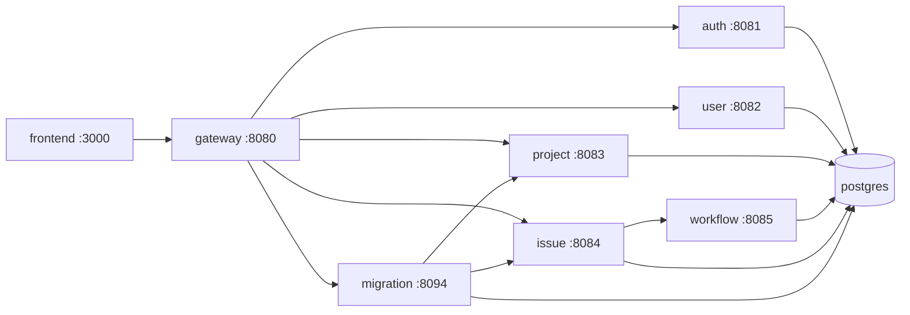

# Migration dev stack

Minimal Docker Compose for fixing and UI-testing **jira-migration-service** without starting all ~20 microservices.

## Quick start

```bash
docker compose -f docker-compose.migration-dev.yml down
docker compose -f docker-compose.migration-dev.yml up -d --build
```

If Flyway was partially applied or you changed SQL migrations:

```bash
docker exec jira-postgres psql -U jiraadmin -d jira_platform -c "DROP SCHEMA IF EXISTS jira_migration CASCADE;"
docker compose -f docker-compose.migration-dev.yml up -d --build migration-service
```

## Stack diagram



## Services in `docker-compose.migration-dev.yml`

| Service | Port | Why |
|---------|------|-----|
| postgres | 5432 | All schemas |
| auth-service | 8081 | JWT + roles for gateway/migration |
| user-service | 8082 | User lookup on import |
| project-service | 8083 | Project CSV/XML persist |
| workflow-service | 8085 | Required by issue-service |
| issue-service | 8084 | Issue import |
| migration-service | 8094 | Flyway V1–V22 + import API |
| gateway | 8080 | `/api/migration/*` routing |
| frontend | 3000 | Migration Center UI |

**Not started:** comment, notification, search, audit, attachment, sprint, plan, admin, test, zipkin.

## Phased fixes (enable more only when needed)

| Phase | Goal | Stack |
|-------|------|--------|
| 1 | Flyway V1–V20+ | postgres + auth + project + issue + workflow + migration |
| 2 | Gateway routing | + gateway |
| 3 | UI | + frontend + user |

## UI test checklist

1. Open http://localhost:3000 — login **ms86100** / **admin123**
2. Migration Center — templates load (`GET /api/migration/templates` → 200)
3. **Project CSV** import — project key from CSV (not auto `MPO`)
4. **Issue CSV** import — requires target project
5. **Jira DC XML** — sample: `jira-migration-service/src/test/resources/samples/jira_dc_issue_export.xml`

## API smoke (no UI)

```bash
curl -s http://localhost:8094/actuator/health
curl -s http://localhost:3000/api/migration/templates
```

## Images

Local tags use `:migration-dev` — **not pushed to GHCR** until you confirm UI tests. Do not commit GitHub PATs to the repo.
