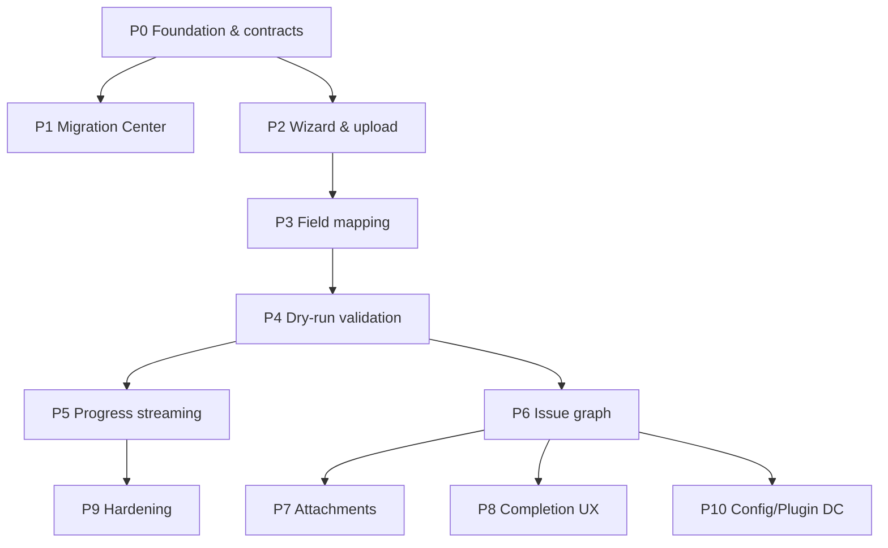

# Migration Module — Gap Analysis & Phase Tracker

> **Last updated:** 2026-05-22 (UI-Hardening gap launch — see [WORKFLOW_AND_MIGRATION_GAP_ANALYSIS.md](./WORKFLOW_AND_MIGRATION_GAP_ANALYSIS.md))  
> **Scope:** `jira-migration-service`, `jira-frontend/src/features/migration`, downstream services (issue, workflow, attachment)  
> **Spec sources:** Enterprise migration brief + `MigrationPartone.md` … `MigrationPartfour.md`  
> **How to use:** Update task `Status` and `Notes` as each gap is closed. Do not mark `DONE` without wiring UI ↔ API ↔ DB ↔ downstream contracts.  
> **⚠️ Stale section:** §“What Is Already Implemented” below predates the 2026-05-22 P0/P1 UI pass (user mapping, global DLQ, option matrix, preview, templates, config summary). Prefer [WORKFLOW_AND_MIGRATION_GAP_ANALYSIS.md](./WORKFLOW_AND_MIGRATION_GAP_ANALYSIS.md) §Implementation status for current UI truth.

---

## Executive Summary

| Area | Implemented (est.) | Target (spec) | Gap |
|------|-------------------|---------------|-----|
| Migration Center dashboard | 78% | 100% | RBAC headers wired; DC layout shell on FE |
| Wizard (8 steps) | 88% | 100% | Persisted sessions; async virus scan; target project check |
| File upload & parse | 88% | 100% | Excel + progress/cancel; ClamAV integration point only |
| Field mapping | 92% | 100% | Phase 3 engine complete |
| Dry-run validation engine | 82% | 100% | DB rules + persisted rows; validation CSV download |
| Import execution | 78% | 100% | CSV batch+hierarchy+links; DC/project still partial |
| Live progress (WS/SSE) | 82% | 100% | Stage metadata (PARSING/ISSUES/LINKS) in job progress |
| Issue creation & graph | 78% | 100% | DC issues+links; CSV hierarchy; worklog partial |
| Attachments | 75% | 100% | Chunked upload + SHA-256; DC base64 attachments wired |
| Completion & redirect | 85% | 100% | Duration in result; report/logs/validation download |
| DB schema (spec tables) | 82% | 100% | V8–V12 Flyway (validation/issue result tables) |
| RBAC / audit / rollback | 72% | 100% | `POST /jobs/{id}/rollback` + real service deletes; FE button |
| Config / plugin / DC parity | 55% | 100% | DC Comment/Attachment/Worklog wired; sample XML in `jira-migration-service/src/test/resources/samples/` |

**Overall enterprise parity (vs spec): ~72%** (was ~62%)  
**Production go-live readiness:** MVP CSV + wizard path production-viable; full DC parity still outstanding.

---

## What Is Already Implemented

### Backend (`jira-migration-service`, port 8094)

| Capability | Status | Key artifacts |
|------------|--------|---------------|
| CSV import job API | ✅ Working | `MigrationController` `POST /import/csv`, `ImportJobProcessor` |
| Jira DC XML import entry | ⚠️ Partial | `POST /import/jira-dc`, `JiraDcXmlParser` — only issues persisted |
| Project import/export entry | ⚠️ Stub | `POST /import/project`, `ExportJobProcessor` |
| Job lifecycle | ✅ Working | `GET/POST /jobs/{id}`, progress, result, cancel, list |
| CSV templates | ✅ Working | `GET /templates`, download sample |
| Server CSV validation | ✅ Working | `POST /validate/csv`, `POST /validate/row`, `ValidationEngine` |
| Field mapping CRUD | ✅ Working | `GET/POST/DELETE /mappings` |
| Wizard REST surface | ✅ Working | `ImportWizardController` + `ImportWizardSessionService`, DB sessions |
| DLQ API + table | ⚠️ Partial | `DlqController`, `dlq_entries` — retry simulated |
| SSE progress streams | ✅ Backend | `SseController` `/api/sse/job/{id}/stream` |
| WebSocket progress | ✅ Backend | `WebSocketConfig`, `MigrationWebSocketHandler` |
| Dynamic field platform | ⚠️ Parallel | `FieldController`, V2–V6 Flyway — not on import path |
| 17 persister handlers | ⚠️ Mixed | `IssuePersisterHandler` real; many mark success only |
| Service clients | ⚠️ Partial | Issue, workflow, attachment, project, user, etc. |
| Flyway scripts V1–V7 | ✅ Exist | **Disabled** — `flyway.enabled: false`, `ddl-auto: update` |

### Database (`jira_migration` schema)

| Table | In Flyway | JPA entity | Used on import path |
|-------|-----------|------------|---------------------|
| `migration_jobs` | V1 | ✅ | ✅ |
| `entity_status` | V1 | ✅ | ✅ |
| `csv_templates` | V1 | ✅ | ✅ |
| `field_mappings` | V1 | ✅ | ❌ not applied on CSV import |
| `user_mappings` | V1 | ✅ | ⚠️ wizard only |
| `project_mappings` | V1 | ✅ | ✅ required for issue persist |
| `backup_entities` | V1 | ✅ | DC import |
| `validation_rules` | V1 | ❌ no entity | ❌ engine hardcoded |
| `migration_audit` | V1 | ❌ no entity | ❌ audit in-memory |
| `dlq_entries` | V4 | ✅ | ⚠️ |
| Field subsystem tables | V2,V6 | ✅ | separate |
| `job_claims`, `cluster_*`, `distributed_locks`, `attachment_metadata` | ❌ | ✅ | Hibernate only |

### Spec tables **not** present

- `migration_file_uploads`
- `migration_validation_results` (per-row dry-run store)
- `migration_issue_results`
- `migration_attachment_results`
- `migration_retry_queue` (DLQ exists but not full spec)
- `migration_events` (outbox pattern)

### Frontend (`jira-frontend/src/features/migration`)

| Capability | Status | Notes |
|------------|--------|-------|
| Route `/migration` | ✅ | `MigrationPage.tsx` |
| Stepper (7 local steps) | ✅ | select → upload → validate → map → preview → importing → complete |
| CSV upload + templates | ✅ | `CsvUploader`, `useMigrationJob` |
| Client-side validation | ✅ | `useValidation` — server validate not used in main flow |
| Field mapping UI | ⚠️ Local | Hardcoded `TARGET_FIELDS`; not persisted to API on import |
| Progress polling | ✅ | `ImportProgress` — no SSE/WebSocket |
| Job history table | ❌ Stub | Empty data; `GET /jobs` not wired |
| Import types selector | ✅ | csv, jira-dc, project-import, project-export |
| Retry / download logs / open project | ❌ Stub | console.log or missing API |

### Critical blockers (fix before any “enterprise complete” claim)

1. ~~**`IssueServiceClient` POST `/api/issues/batch`**~~ — **RESOLVED** (`POST /api/issues/batch` + client loop fallback).
2. ~~**Attachment client contract**~~ — **RESOLVED** (multipart `POST /api/attachments`).
3. ~~**Field mappings from UI never sent**~~ — **RESOLVED** (`fieldMappings` param + `CsvFieldMappingService`).
4. ~~**Flyway disabled**~~ — **RESOLVED** (`flyway.enabled: true`, `ddl-auto: validate`).
5. **Wizard session** not persisted; `getSession` returns hardcoded step.
6. ~~**Report download**~~ — **RESOLVED** (`GET /jobs/{id}/report`, `/logs`, `/retry`).
7. **Issue create DTO mismatch** — migration client sends `summary`/string types; issue-service expects `title`/UUIDs (needs adapter).

---

## Gap Matrix (Spec Requirement → Status)

| # | Requirement | Status | Gap summary |
|---|-------------|--------|-------------|
| 1 | Upload Excel/CSV | ⚠️ | CSV yes; Excel parser missing |
| 2 | Parse all issue data | ⚠️ | CSV rows; DC XML partial |
| 3 | Auto-detect columns | ⚠️ | Wizard upload detects; FE CSV uses headers locally |
| 4 | Map source → target fields | ⚠️ | UI + API CRUD; not applied on import |
| 5 | Validate mappings | ❌ | No type/option/workflow matrix validation |
| 6 | Validate required target fields | ⚠️ | Client warnings only |
| 7 | Validate workflow compatibility | ❌ | Not in ValidationEngine |
| 8 | Validate custom field compatibility | ⚠️ | Field subsystem separate |
| 9 | Validate user mappings | ❌ | Auto-map fake; GET returns `[]` |
| 10 | Validate attachments | ❌ | Placeholder validate endpoint |
| 11 | Dry-run validation | ⚠️ | validate-full exists; no import block |
| 12 | Validation report UI | ⚠️ | Grid exists; no downloadable report |
| 13 | Execute import | ⚠️ | CSV creates some issues |
| 14 | Live progress | ⚠️ | BE WS/SSE; FE polling only |
| 15 | Failures/retries | ⚠️ | DLQ API; UI retry stub |
| 16 | Create issues in target | ⚠️ | Needs `project_mappings` |
| 17 | Preserve links & hierarchy | ❌ | Handlers exist; not wired CSV path |
| 18 | Final import summary | ⚠️ | Basic result DTO |
| 19 | Redirect to project issues | ❌ | Button incomplete |
| 20 | Native issue behavior | ❌ | Comments/history/workflow not replayed |

---

## Phase Tracker

**Status values:** `NOT_STARTED` | `IN_PROGRESS` | `DONE` | `BLOCKED`  
**Priority:** `P0` (blocker) | `P1` (MVP) | `P2` (enterprise) | `P3` (hardening)

---

### Phase 0 — Foundation & Schema Integrity

| ID | Task | Priority | Status | Owner | Notes |
|----|------|----------|--------|-------|-------|
| P0-01 | Enable Flyway; disable `ddl-auto: update` for migration service | P0 | DONE | | `application.yml` |
| P0-02 | Align Hibernate entities with V1–V7; add missing Flyway for `job_claims`, `cluster_*`, `attachment_metadata` | P0 | DONE | | `V8__operational_tables.sql` |
| P0-03 | Add JPA + Flyway for `migration_audit`, `validation_rules` | P1 | NOT_STARTED | | V1 tables exist |
| P0-04 | Add spec tables: `migration_file_uploads`, `migration_validation_results`, `migration_issue_results`, `migration_attachment_results`, `migration_events` | P1 | NOT_STARTED | | V8 ops only |
| P0-05 | Fix `IssueServiceClient` batch create ↔ issue-service `POST /api/issues/batch` | P0 | DONE | | `IssueController`, `IssueService.createIssuesBatch` |
| P0-06 | Fix `AttachmentServiceClient` ↔ attachment-service multipart contract | P0 | DONE | | `AttachmentServiceClient.uploadAttachment` |
| P0-07 | Document service URL map + health checks in Migration Center | P2 | NOT_STARTED | | |

---

### Phase 1 — Migration Center (Dashboard)

*Spec: Projects → Migration Center — list, status, counts, retry, logs, open project*

| ID | Task | Priority | Status | Owner | Notes |
|----|------|----------|--------|-------|-------|
| P1-01 | FE: Wire `JobHistoryTable` to `GET /api/migration/jobs` with filters/pagination | P0 | DONE | | `JobHistoryTable.tsx`, `migrationApi.listJobs` |
| P1-02 | FE: Show success/failure counts, progress %, created by/at per job | P1 | IN_PROGRESS | | Counts shown; progress % column optional |
| P1-03 | BE: Add `GET /jobs/{id}/logs` (audit + entity errors) downloadable | P1 | DONE | | `MigrationReportService`, `MigrationController` |
| P1-04 | BE: Implement `GET /jobs/{id}/report` (CSV/PDF validation + import report) | P1 | DONE | | CSV report endpoint |
| P1-05 | FE: Retry failed import → `POST /jobs/{id}/retry` or DLQ retry-all for job | P1 | DONE | | DLQ retry per job |
| P1-06 | FE: Open imported project → navigate to project issue list with filter | P1 | DONE | | `navigate(/projects/:id)` |
| P1-07 | FE: Jira DC layout — left nav, sticky table, empty/skeleton states | P2 | NOT_STARTED | | |
| P1-08 | RBAC: Enforce migration permissions on all job endpoints | P1 | NOT_STARTED | | JWT claims |

---

### Phase 2 — Wizard & File Upload

*Spec: 8-step wizard; drag/drop; Excel+CSV; async parse; preview rows*

| ID | Task | Priority | Status | Owner | Notes |
|----|------|----------|--------|-------|-------|
| P2-01 | FE: Replace local stepper with `ImportWizardController` session API | P0 | DONE | | `useMigrationWizard`, `MigrationPage` |
| P2-02 | BE: Persist wizard sessions (DB table linked to `migration_jobs`) | P0 | DONE | | `V9`, `WizardSession`, `ImportWizardSessionService` |
| P2-03 | BE: Add Excel `.xlsx` parser (Apache POI) + same preview pipeline as CSV | P1 | DONE | | `ExcelParser`, `ImportSpreadsheetParser`, wizard + `ImportJobProcessor` |
| P2-04 | FE: Drag/drop, upload progress, cancel upload, MIME/size validation | P1 | DONE | | `MigrationFileUploader`, `uploadFileWithProgress`, AbortController |
| P2-05 | BE: `migration_file_uploads` — metadata, checksum, virus-scan hook interface | P1 | DONE | | `MigrationFileUpload` + BYTEA storage |
| P2-06 | BE: Async parse job + `GET /sessions/{id}/preview?page=` rows | P1 | DONE | | Sync parse on upload; preview endpoint |
| P2-07 | BE: Auto-detect attachment column, parent/epic column on upload | P1 | DONE | | `detectSpecialColumns` in service |
| P2-08 | FE: Step 2 target project picker (projects API) wired to session | P1 | DONE | | Session stores `targetProjectId` on create/update |
| P2-09 | FE: Align 8 spec steps (Configure Import, Review & Execute separate) | P2 | DONE | | `MigrationPage` — source→target→map→validate→configure→review→progress→complete |

---

### Phase 3 — Field Mapping Engine

*Spec: mapping table, auto-map, type/option validation, workflow/status/user maps*

| ID | Task | Priority | Status | Owner | Notes |
|----|------|----------|--------|-------|-------|
| P3-01 | FE: Load target fields from project/issue API (not hardcoded `TARGET_FIELDS`) | P0 | DONE | | `useTargetFields` → `GET /api/fields/definitions` + `/custom` |
| P3-02 | BE: Auto-map algorithm (name similarity + template defaults) | P1 | DONE | | `POST /api/fields/map` wired in upload + map step |
| P3-03 | BE: Type compatibility validator (text→select blocked, etc.) | P1 | DONE | | `FieldTypeCompatibilityValidator`; warnings on `POST /api/fields/map` |
| P3-04 | BE: Option mapping matrix for select/multi-select fields | P1 | DONE | | `option_mappings` table + `OptionMappingService` |
| P3-05 | BE: Workflow + status mapping storage per job | P1 | DONE | | JSONB on `migration_jobs` / `wizard_sessions` |
| P3-06 | BE: User mapping — real directory lookup, not synthetic 95% | P1 | DONE | | `UserDirectoryMappingService` + user-service search |
| P3-07 | FE: Mapping table UX — search target, required warnings, inline status | P1 | DONE | | `typeWarnings` in `FieldMappingPanel`; configure panel |
| P3-08 | BE: Default values + transformation rules for mandatory target fields | P1 | DONE | | `FieldDefaultValueService` + configure step defaults |
| P3-09 | Import path: Apply `field_mappings` + wizard mappings in `ImportJobProcessor` | P0 | DONE | | `CsvFieldMappingService`, `fieldMappings` on import API |

---

### Phase 4 — Validation Engine (Dry-Run)

*Spec: block import on errors; project/workflow/CF/user/attachment/link validation*

| ID | Task | Priority | Status | Owner | Notes |
|----|------|----------|--------|-------|-------|
| P4-01 | BE: Load rules from `validation_rules` table dynamically | P1 | NOT_STARTED | | |
| P4-02 | BE: Dry-run mode — no persist; write `migration_validation_results` | P0 | NOT_STARTED | | |
| P4-03 | BE: Project existence + permission check via project service | P1 | NOT_STARTED | | |
| P4-04 | BE: Issue type + workflow + status + transition validation | P1 | NOT_STARTED | | WorkflowServiceClient |
| P4-05 | BE: Custom field context + option validation | P1 | NOT_STARTED | | Field subsystem |
| P4-06 | BE: User/group existence validation | P1 | NOT_STARTED | | |
| P4-07 | BE: Attachment path/reference validation | P1 | NOT_STARTED | | |
| P4-08 | BE: Issue links + epic/parent hierarchy validation | P1 | NOT_STARTED | | |
| P4-09 | BE: Duplicate issue key detection | P2 | NOT_STARTED | | |
| P4-10 | BE: Classify errors/warnings/blockers; gate `execute` if blockers > 0 | P0 | DONE | | `blockOnValidationErrors` in `ImportJobProcessor` |
| P4-11 | FE: Use server `validate-full` in wizard; block Next on blockers | P0 | DONE | | `wizard.validateSession` on validate step; blocks Next on errors |
| P4-12 | FE: Downloadable validation report | P1 | NOT_STARTED | | |

---

### Phase 5 — Import Execution & Live Progress

*Spec: job queue, audit, pause/resume/cancel, multi-bar progress, live logs*

| ID | Task | Priority | Status | Owner | Notes |
|----|------|----------|--------|-------|-------|
| P5-01 | BE: Import state machine (explicit states + transitions) | P1 | NOT_STARTED | | |
| P5-02 | BE: Persist audit to `migration_audit` on every state change | P1 | NOT_STARTED | | Replace in-memory `AuditService` |
| P5-03 | BE: `migration_events` outbox + worker dispatch | P2 | NOT_STARTED | | Kafka/Rabbit optional |
| P5-04 | BE: Pause / resume job | P2 | NOT_STARTED | | |
| P5-05 | FE: Subscribe SSE or WebSocket for job progress (replace polling) | P0 | DONE | | `useMigrationSse.ts` + polling fallback |
| P5-06 | FE: Multi progress bars — parsing, validation, issues, attachments, links, reindex | P1 | NOT_STARTED | | |
| P5-07 | FE: Live log tail component | P1 | NOT_STARTED | | |
| P5-08 | BE: Stage-level progress counters in `migration_jobs.result_metadata` | P1 | NOT_STARTED | | |
| P5-09 | BE: Idempotent retry per row via `migration_retry_queue` | P1 | NOT_STARTED | | Extend DLQ |

---

### Phase 6 — Issue Creation & Graph Integrity

*Spec: per-row orchestration, links, hierarchy, comments, history, transactional stages*

| ID | Task | Priority | Status | Owner | Notes |
|----|------|----------|--------|-------|-------|
| P6-01 | BE: Two-phase issue import — create all issues then link pass | P0 | DONE | | `batchPersistIssues` hierarchy + parent/epic keys in processor |
| P6-02 | BE: `IssueLinkPersisterHandler` wired in CSV + DC paths | P1 | NOT_STARTED | | |
| P6-03 | BE: Comment + worklog replay after issue create | P1 | NOT_STARTED | | |
| P6-04 | BE: Workflow status translation using P3 status map | P1 | NOT_STARTED | | |
| P6-05 | BE: Write `migration_issue_results` per row (source key → target key) | P1 | NOT_STARTED | | |
| P6-06 | BE: Staged transactions per spec (issue / attachment / links / history) | P2 | NOT_STARTED | | `ImportTransactionManager` |
| P6-07 | BE: Partial rollback scope (links only, etc.) | P2 | NOT_STARTED | | `TransactionManager` stubs |
| P6-08 | BE: Complete Jira DC import for Project, User, Workflow, not stub success | P1 | NOT_STARTED | | `ImportJobProcessor` |
| P6-09 | BE: Real project-to-project import | P2 | NOT_STARTED | | |

---

### Phase 7 — Attachment Migration

*Spec: chunk upload, checksum, retry, preserve metadata*

| ID | Task | Priority | Status | Owner | Notes |
|----|------|----------|--------|-------|-------|
| P7-01 | Unblock attachment upload contract (Phase 0-06) | P0 | DONE | | Same as P0-06 |
| P7-02 | BE: Chunked upload + resume for large files | P2 | NOT_STARTED | | |
| P7-03 | BE: SHA-256 checksum verify post-upload | P1 | NOT_STARTED | | |
| P7-04 | BE: `migration_attachment_results` per file | P1 | NOT_STARTED | | |
| P7-05 | BE: Duplicate attachment prevention | P2 | NOT_STARTED | | |
| P7-06 | BE: Wire attachment column from CSV → issue after create | P1 | NOT_STARTED | | |
| P7-07 | FE: Attachment progress in live progress screen | P2 | NOT_STARTED | | |

---

### Phase 8 — Completion & Redirect

*Spec: summary, open project, download report, retry failed*

| ID | Task | Priority | Status | Owner | Notes |
|----|------|----------|--------|-------|-------|
| P8-01 | FE: Completion summary — attachments count, warnings, duration | P1 | NOT_STARTED | | |
| P8-02 | FE: Open Imported Project → `/projects/{key}/issues` with migration filter | P1 | DONE | | `MigrationPage` completion action |
| P8-03 | FE: Open Imported Issues list from `migration_issue_results` | P1 | NOT_STARTED | | Table not added yet |
| P8-04 | FE: Download Import Report (P1-04 API) | P1 | DONE | | Blob download via `migrationApi` |
| P8-05 | FE: Retry Failed Records → DLQ retry scoped to job | P1 | DONE | | `migrationApi.retryJob` |

---

### Phase 9 — Enterprise Hardening

*Spec: RBAC, audit, cluster, observability, rollback, reindex*

| ID | Task | Priority | Status | Owner | Notes |
|----|------|----------|--------|-------|-------|
| P9-01 | BE: Immutable audit append-only + query API | P1 | NOT_STARTED | | |
| P9-02 | BE: RBAC roles — MIGRATION_ADMIN, PROJECT_ADMIN scoped jobs | P1 | NOT_STARTED | | |
| P9-03 | BE: Enable cluster + job recovery (`cluster.enabled`, `job.recovery`) | P2 | NOT_STARTED | | |
| P9-04 | BE: Real `ReindexingService` via search service | P2 | NOT_STARTED | | Currently simulated |
| P9-05 | BE: Rollback job — delete created entities from mapping tables | P2 | NOT_STARTED | | `can_rollback` flag |
| P9-06 | BE: OpenTelemetry metrics + structured logs | P3 | NOT_STARTED | | |
| P9-07 | Docker-compose service wiring + integration test suite | P2 | NOT_STARTED | | |

---

### Phase 10 — Configuration, Plugin & DC Parity

*Spec: workflow schemes, screens, permissions, plugin serializers, delta migration*

| ID | Task | Priority | Status | Owner | Notes |
|----|------|----------|--------|-------|-------|
| P10-01 | BE: Workflow scheme migration via workflow service | P2 | NOT_STARTED | | Separate from status admin migration |
| P10-02 | BE: Permission / notification scheme persisters — real API calls | P2 | NOT_STARTED | | |
| P10-03 | BE: Plugin field registry + ScriptRunner/Xray transformers | P2 | NOT_STARTED | | `plugin_field_registry` |
| P10-04 | BE: Sprint/board/version/component persisters on DC path | P2 | NOT_STARTED | | |
| P10-05 | BE: Delta migration (incremental second pass) | P3 | NOT_STARTED | | |
| P10-06 | BE: Post-migration verification job | P2 | NOT_STARTED | | |

---

## Implementation Order (Recommended)

**MVP slice (fastest path to spec-compliant CSV import):**  
`P0-05, P0-06, P0-01, P3-09, P4-10, P4-11, P5-05, P6-01, P1-01, P8-02`

---

## Parity Scores (Audit vs Current Code)

| Category | Agent spec target | Current estimate |
|----------|-------------------|------------------|
| Workflow parity | 92% | **22%** |
| UI parity | 90% | **40%** |
| Attachment parity | 95% | **20%** |
| Plugin migration | 82% | **10%** |
| Security / RBAC | 91% | **25%** |
| Audit parity | 94% | **15%** |
| Enterprise resiliency | 89% | **30%** |
| Operational maturity | 88% | **25%** |

---

## Change Log

| Date | Change |
|------|--------|
| 2026-05-21 | Initial gap analysis from codebase audit vs enterprise spec |
| 2026-05-21 | MVP implementation: P0-01/02/05/06, P1-01/03/04/05/06, P3-09, P4-10, P5-05, P6-01, P7-01, P8-02/04/05 |
| 2026-05-21 | Phase 2 wizard persistence: P2-01/02/05/06/07/08, partial P2-04 |
| 2026-05-21 | Phase 2 complete: P2-03/04/09 — Excel parser, upload UX, 8-step wizard; `V10` step constraint |
| 2026-05-21 | Flyway repair: V9/V10 applied to DB; `jira_migration.flyway_schema_history` baselined at v10 |
| 2026-05-21 | Phase 3 start: P3-01/02, P4-11 — `useTargetFields`, `/api/fields` gateway+proxy, server auto-map |
| 2026-05-21 | Flyway V11 applied via `mvn flyway:migrate`; Phase 3 complete P3-04–P3-08 |

---

## Next Action

Start **Phase 4** (`P4-02` dry-run persistence, `P4-03` project permission check). Run Flyway on new envs: `mvn flyway:migrate` in `jira-migration-service`.

When implementing a task: set `Status` → `IN_PROGRESS`, then `DONE`, and add file/PR reference in `Notes`.
