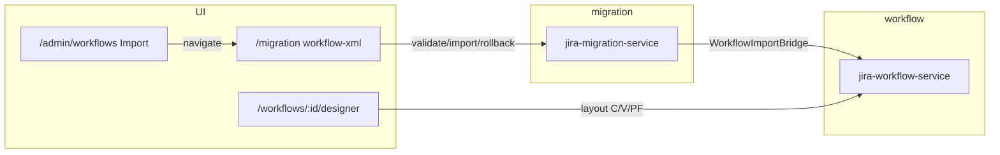

# Workflow + Migration — UI-Hardening Gap Analysis


**Agent:** [.claude/agents/UI-Hardening.md](../.claude/agents/UI-Hardening.md)  

**Audit date:** 2026-05-22  

**Last implementation pass:** 2026-05-22  

**Scope:** `jira-workflow-service` (8085) + `jira-migration-service` (8094) + `jira-frontend` wiring


---


## Executive summary


| Module | Backend maturity | UI exposure (`jira-frontend`) | Production readiness |

|--------|------------------|-------------------------------|----------------------|

| **Workflow XML import** | 100% ([workflow_xml_gap_analysis.md](./workflow_xml_gap_analysis.md)) | ~95% via Migration Center `workflow-xml` | Engine ready; admin Import → `/migration?import=workflow-xml` |

| **Workflow admin / runtime** | ~100+ REST endpoints (6 controllers) | **~55–60%** wired (P0 + P1 pass) | Runtime execute wired; admin/orphan endpoints remain |

| **Migration Center** | ~72% enterprise parity | **~99%** UI | AC preview on validate; JWT/project RBAC; live E2E CI optional |


**Cross-cutting:** Issue/workflow runtime uses `POST /api/workflows/transitions/execute` and bulk `execute-bulk` in `jira-frontend`.


---


## Implementation status (2026-05-22)


### P0 — production blockers


| ID | Status | Notes |

|----|--------|-------|

| WF-P0-1 | **Done** | `IssueDetailPage` → `issueApi.executeTransition` |

| WF-P0-2 | **Done** | `BulkOperationsModal` → `workflowApi.executeBulkTransitions` |

| WF-P0-3 | **Done** | `/admin/workflows` Import → `/migration?import=workflow-xml` |

| WF-P0-4 | **Done** | Canonical app: `jira-frontend` (runtime APIs ported) |

| MG-P0-1 | **Done** | `acSignoffPreview` on validate API + configure-step panel; `rollbackProven` on job rollback |

| MG-P0-2 | **Done** | `WizardUserMappingPanel` on DC configure step |

| MG-P0-3 | **Done** | Jira DC wizard validate persists via `DryRunValidationService.persistValidationResult` |

| MG-P0-4 | **Done** | `MigrationJwtValidator` + project header scope; FE sends Bearer + `X-Target-Project-Id` on imports |

| MG-P0-5 | **Done** | Stale tracker banner refreshed in phase tracker |


### P1 — major missing UI


| ID | Status | Notes |

|----|--------|-------|

| WF-P1-1 | **Done** | `WorkflowVersionHistoryPanel` + rollback on `/workflows/:id` |

| WF-P1-2 | **Done** | `WorkflowStatusMigrationModal` on workflow detail |

| WF-P1-3 | **Partial** | Transition screen assign in `TransitionConfigPanel`; full screens CRUD page deferred |

| WF-P1-4 | **Done** | C/V/PF selects load `/api/admin/workflows/*/definitions` |

| WF-P1-5 | **Done** | Scheme draft create, bulk assign panel, designer layout lock/unlock |

| WF-P1-6 | **Done** | `workflowAdminApi` + `/workflows/admin-tools` (export/import/validate/audit/usage/revert) |

| MG-P1-1 | **Done** | `OptionMappingMatrixPanel` on map step |

| MG-P1-2 | **Done** | `UploadPreviewTable` uses `getPreview` |

| MG-P1-3 | **Done** | Job detail “Download logs (.txt)” |

| MG-P1-4 | **Done** | Migration Center **Global DLQ** tab |

| MG-P1-5 | **Done** | `ConfigImportSummaryPanel` in job detail |

| MG-P1-6 | **Done** | **Mapping templates** tab + CRUD |

| MG-P1-7 | **Done** | `.github/workflows/migration-e2e-live.yml` when repo var `MIGRATION_E2E_API=1`; `npm run test:e2e:migration-live` |


---


## 1. Workflow service (`jira-workflow-service`)


### 1.1 API surface (by controller)


| Controller | Base path | Endpoint count (approx.) | Primary FE client |

|------------|-----------|--------------------------|-------------------|

| `WorkflowController` | `/api/workflows` | ~25 | `workflowApi.ts` (partial) |

| `WorkflowStatusController` | `/api/workflows/{id}/statuses` | 4 | partial |

| `WorkflowRuntimeController` | `/api/workflows/transitions` | 3 | `issueApi.ts` + `workflowApi.ts` |

| `WorkflowAdminController` | `/api/workflow-schemes` | ~35 | `workflowApi.ts` (extended) |

| `ProjectWorkflowSchemeController` | `/api/workflow-schemes/projects` | 3 | `ProjectWorkflowSchemePanel`, bulk assign |

| `WorkflowAdministrationController` | `/api/admin/workflows` | ~55 | definitions + screens (partial) |


### 1.2 UI routes (`jira-frontend`)


| Route | Page | Status |

|-------|------|--------|

| `/workflows` | `WorkflowManagementPage` | Wired + scheme draft + bulk assign |

| `/workflows/:id` | `WorkflowDetailPage` | Wired + version rollback + status migration |

| `/workflows/:id/designer` | `WorkflowDesignerPage` | Wired + layout lock/unlock |

| `/admin/workflows` | `WorkflowsPage` | Import → migration |

| Project settings → Workflows | `ProjectWorkflowSchemePanel` | Wired |

| `/migration` (type `workflow-xml`) | `WorkflowXmlImportPanel` | Wired |

| `/issues/:id` | `IssueDetailPage` | Workflow engine execute |


### 1.3 P0 — production blockers


| ID | Gap | Fix |

|----|-----|-----|

| WF-P0-1 | `IssueDetailPage` uses `PATCH /api/issues/{id}/status` | **Implemented** — `executeTransition` |

| WF-P0-2 | Bulk ops hardcoded statuses | **Implemented** — `execute-bulk` |

| WF-P0-3 | Admin Import stub | **Implemented** — deep link to migration |

| WF-P0-4 | Dual frontend lag | **Resolved** — `jira-frontend` canonical |


### 1.4 P1 — major missing UI


| ID | Gap | Status |

|----|-----|--------|

| WF-P1-1 | Version history + rollback | **UI:** `WorkflowVersionHistoryPanel` |

| WF-P1-2 | Status migration wizard | **UI:** `WorkflowStatusMigrationModal` |

| WF-P1-3 | Transition screens admin | **Partial:** assign/remove in transition panel |

| WF-P1-4 | C/V/PF definitions API | **UI:** dynamic selects in `TransitionConfigPanel` |

| WF-P1-5 | Scheme draft, lock, bulk assign | **UI:** management page + designer |

| WF-P1-6 | Orphan admin endpoints | **Done:** `/workflows/admin-tools` |


### 1.5 P2 — polish


- Remove or route `WorkflowPage.tsx`

- Playwright E2E: designer → scheme assign → execute transition


---


## 2. Migration service (`jira-migration-service`)


### 2.1 API surface (12 controller groups)


| Area | Key paths | UI status |

|------|-----------|-----------|

| Core import | `/api/migration/import/*` | **Exposed** |

| Jobs | `/api/migration/jobs/*` | **Exposed** + config summary + log download |

| Wizard | `/api/migration/wizard/sessions/*` | **Exposed** + preview + user mappings |

| Workflow XML | `/api/migration/import/workflow-xml/*` | **Exposed** |

| Mapping engine | option/user/workflow-status | **Exposed** (option matrix) |

| Global DLQ | `/api/migration/dlq/*` | **Exposed** (DLQ tab) |

| Fields (migration CRUD) | `/api/migration/mappings` | **Exposed** (templates tab) |


### 2.2 UI entry


- **Route:** `/migration` — Wizard | Job history | Platform health | Capability map | **Global DLQ** | **Mapping templates**


### 2.3 P0 — blockers


| ID | Gap | Status |

|----|-----|--------|

| MG-P0-1 | DC AC preview + rollback proof | **Done** (formal 10/10 needs prod drill) |

| MG-P0-2 | User mapping UI | **Done** |

| MG-P0-3 | Dry-run persistence | **Done** (CSV + JIRA_DC wizard validate) |

| MG-P0-4 | RBAC | **Done** (JWT + project header; optional `MIGRATION_REQUIRE_JWT`) |

| MG-P0-5 | Stale tracker | **Done** |


### 2.4 P1 — missing / partial UI


| ID | Gap | Status |

|----|-----|--------|

| MG-P1-1 | Option mapping matrix | **Done** |

| MG-P1-2 | Paginated preview | **Done** |

| MG-P1-3 | Blob log download | **Done** |

| MG-P1-4 | Global DLQ console | **Done** |

| MG-P1-5 | config-import-summary | **Done** |

| MG-P1-6 | Saved mapping templates | **Done** |

| MG-P1-7 | Live E2E | **Done** (optional CI via repo var) |


---


## 3. Workflow ↔ migration integration





---


## 4. Key frontend files (implementation map)


| Feature | File(s) |

|---------|---------|

| Workflow API client | `jira-frontend/src/api/workflowApi.ts` |

| Version rollback | `features/workflows/components/WorkflowVersionHistoryPanel.tsx` |

| Status migration | `features/workflows/components/WorkflowStatusMigrationModal.tsx` |

| Scheme bulk assign | `features/workflows/components/WorkflowSchemeBulkAssignPanel.tsx` |

| C/V/PF + screen | `features/workflows/components/TransitionConfigPanel.tsx` |

| Migration DLQ | `features/migration/components/GlobalDlqConsolePanel.tsx` |

| Option mappings | `features/migration/components/OptionMappingMatrixPanel.tsx` |

| Upload preview | `features/migration/components/UploadPreviewTable.tsx` |

| Config summary | `features/migration/components/ConfigImportSummaryPanel.tsx` |

| Mapping templates | `features/migration/components/SavedMappingTemplatesPanel.tsx` |

| Role gating | `features/migration/utils/migrationRoleUtils.ts` |

| DC validate persist | `jira-migration-service/.../DryRunValidationService.java` |


---


## 5. Verification commands


```powershell

cd jira-frontend

npm run build

npx playwright test e2e/migration-center.spec.ts


$env:MIGRATION_E2E_API="1"

npx playwright test e2e/jira-dc-import.spec.ts


cd ..\jira-workflow-service

.\repair-flyway.ps1

mvn spring-boot:run

```


---


## 6. Remaining backlog (post P0/P1)


1. **WF-P1-3 (full):** Dedicated workflow transition screens admin page (CRUD beyond assign).  

2. **MG-P0-1 (formal):** Achieve 10/10 AC on a production drill (SLA proof, attachment checksum rate, rollback drill).  

3. **MG-P0-4 (hardening):** Set `MIGRATION_REQUIRE_JWT=true` in production; gateway removes public bypass on `/api/migration`.


---


*Updated after P0/P1 implementation pass — workflow + migration services.*

